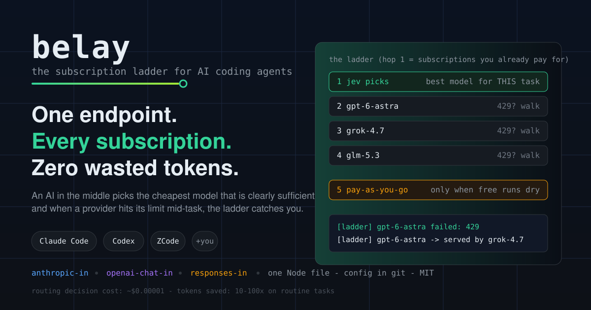

# belay

<p align="center"></p>

**belay** is a single-file AI model router that sits between your coding agent
and every subscription you already pay for. An AI in the middle picks the
cheapest model that is clearly sufficient for each task, and when a provider
hits its limit mid-task, the ladder catches you: your session never dies.

```
Claude Code ─┐                          ┌─ 🚀 frontier (your sub)
Codex ───────┼──▶ belay :4000 ── jev ──┼─ 🧠 workhorse (your sub)
ZCode ───────┘    (translates all     ├─ ⚡ economical (your sub)
+ any harness      three dialects)    └─ 🌍 pay-as-you-go (only when free runs dry)
```

## Why

- **You pay for multiple subscriptions but use one at a time.** belay pools them behind one endpoint and burns each one to exhaustion before spending a cent on pay-as-you-go.
- **Routing by config file is static.** belay asks an AI (the jev System One decision layer, ~$0.00001 per decision) to pick the cheapest *sufficient* model per task, so frontier models get saved for hard work automatically.
- **Harnesses speak different dialects.** belay accepts Anthropic Messages, OpenAI Chat Completions, and OpenAI Responses on the same port and translates in both directions, including streaming.

## The route tag

Because a ladder can hop models mid-fleet, belay signs its work: the reasoning
summary carries the routed identity, one glyph per route, config-driven:

```
· 🚀astra:low ·   <- frontier served this
· ⚡luna ·        <- economical served this
· 🌍or-cheap ·    <- an external fallback served this
```

You see exactly who handled the task while the work streams by. Glyphs and
short names are per-candidate config; unknown routes show 🌍.

## Feature table

| | belay | LiteLLM | OpenRouter | claude-code-router |
|---|---|---|---|---|
| Your existing subscriptions as backends (OAuth) | YES core | no | no | partial |
| AI picks the model per task (~$0.00001) | YES | no, static | no | no |
| Exhaustion ladder: all free before paid | YES | key-based | n/a | no |
| 3 inbound dialects (anthropic / openai-chat / responses) | YES | YES | YES | anthropic only |
| Fleet mode: config in git, machines self-setup + 15-min sync, hot reload | YES | no | no | no |
| Single-file Node, readable in one sitting | YES | large Python | hosted | medium |

## Quickstart

```bash
git clone https://github.com/chrisl10/belay && cd belay/engine
npm install
BELAY_MASTER_KEY=dev-key node server.js          # uses belay.config.json (see QUICKSTART)
```

Then point any harness at `http://127.0.0.1:4000`. Full walkthrough in
[QUICKSTART.md](QUICKSTART.md). Works with Claude Code, Codex, ZCode out of the
box; more harnesses in [HARNESS-ROADMAP.md](HARNESS-ROADMAP.md).

## The ladder

```
[ladder] gpt-6-astra failed: 429
[ladder] gpt-6-astra -> served by grok-4.7     <- your session never noticed
```

Chains are config: `["gpt-6-astra", "grok-4.7", "@openrouter"]` means "frontier
first, then grok, then pay-as-you-go, in that order, always." `@openrouter`
expands to your Hop-2 fallback list. Lanes: direct OAuth subscriptions
(ChatGPT/Codex, Grok CLI), OpenAI-compatible proxies (LiteLLM), and
OpenRouter-style HTTP APIs.

## Docs

- [QUICKSTART.md](QUICKSTART.md): zero to first routed request
- [SCHEMA.md](SCHEMA.md): every config field
- [ARCHITECTURE.md](ARCHITECTURE.md): dialects, ladder, jev, SSE translation
- [FAQ.md](FAQ.md): ToS honesty, cost math, comparison details
- [HARNESS-ROADMAP.md](HARNESS-ROADMAP.md): the big 3 + the expansion queue

## Honesty section

Subscription OAuth lanes (ChatGPT/Codex backend, Grok CLI tokens) are
**unofficial**: they use the subscriptions you already have, driven by your own
credentials on your own machine. Providers did not design them for routing.
Read your terms, bring your own credentials, your call. Everything else (API-key
lanes, LiteLLM, OpenRouter) is plain documented API usage. belay talks to
exactly two places: your model providers, and the jev routing decision service
(your key; without it belay falls back to a heuristic picker and keeps working).

## License

[MIT](LICENSE)
